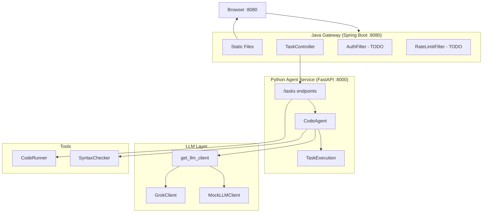
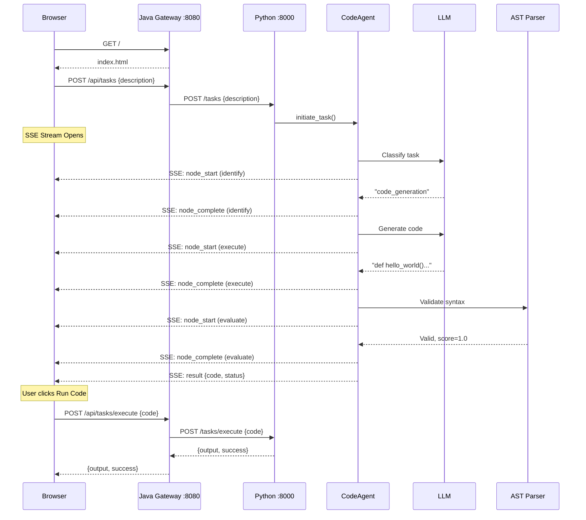
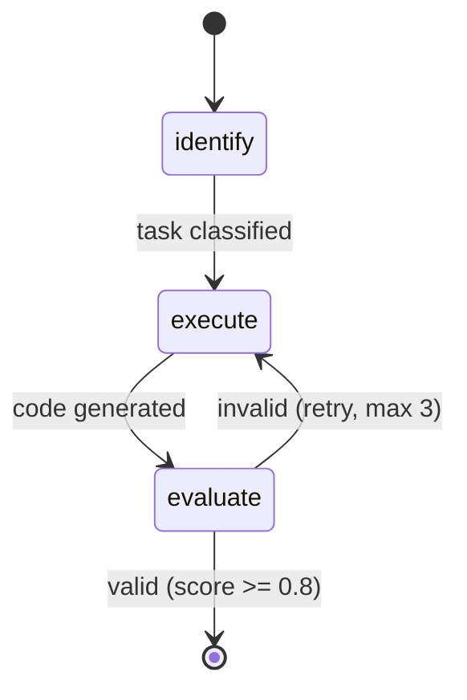

# Code Agent Platform

AI-powered code generation platform demonstrating enterprise agentic AI patterns.

## Quick Start
```bash
# Terminal 1: Python agent-service
cd agent-service
source ../.venv/bin/activate
USE_MOCK_LLM=true uvicorn app.main:app --reload

# Terminal 2: Java gateway
cd gateway-service
./mvnw spring-boot:run

# Open http://localhost:8080
```

## Current Architecture


## Request Flow


## CodeAgent Workflow (LangGraph)


| Node | Purpose | Tool |
|------|---------|------|
| identify | Classify task type | LLM |
| execute | Generate Python code | LLM |
| evaluate | Validate syntax | AST Parser |

## Key Files

### Java Gateway
| File | Purpose |
|------|---------|
| `GatewayApplication.java` | Spring Boot entry |
| `TaskController.java` | Proxy to Python, SSE streaming |
| `AuthFilter.java` | JWT validation (TODO) |
| `RateLimitFilter.java` | Rate limiting (TODO) |

### Python Agent
| File | Purpose |
|------|---------|
| `routes.py` | POST /tasks, /tasks/execute |
| `code_agent.py` | LangGraph workflow |
| `task_execution.py` | Observable progress, SSE events |
| `grok_client.py` | xAI Grok LLM |
| `mock_client.py` | Mock LLM for testing |
| `logging_utils.py` | Request tracing [req-xxx] |

## Server Logs
```bash
# Python logs
tail -f /tmp/python-server.log

# Java logs
tail -f /tmp/java-server.log

# Filter by request ID
grep "req-abc123" /tmp/python-server.log
```

## Module Status

| Module | Status |
|--------|--------|
| 1-5 Foundation | ✅ |
| 6 SSE Streaming | ✅ |
| 7 Code Execution | ✅ |
| 8 Java Gateway | ✅ |
| 9+ See README | 📋 |
