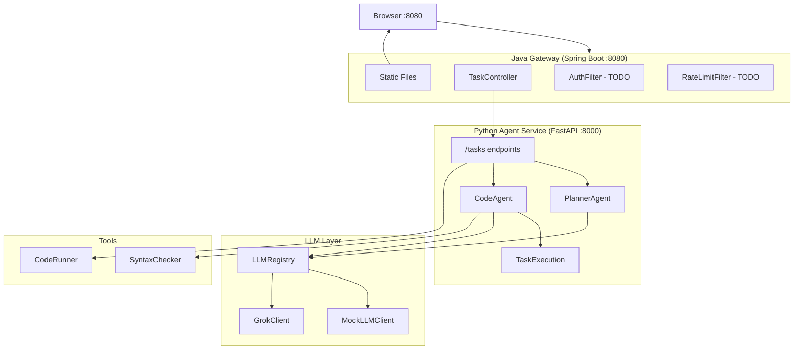
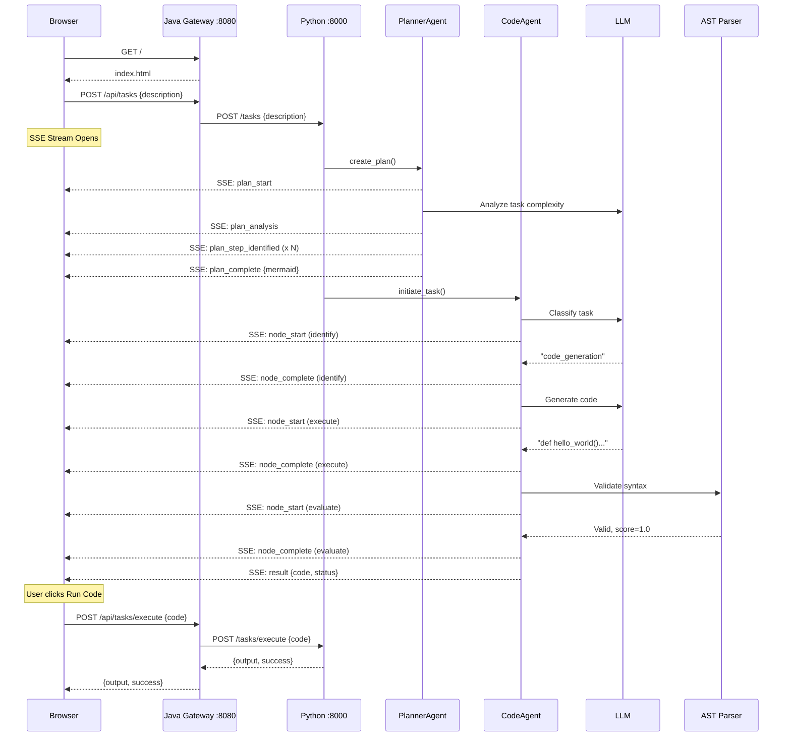
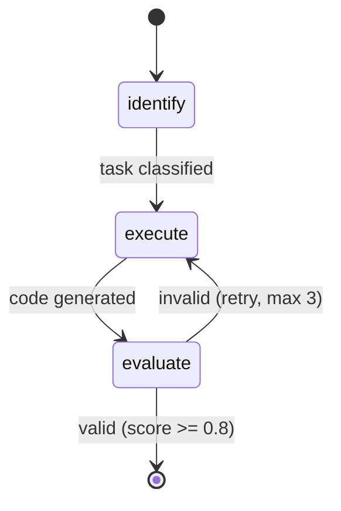
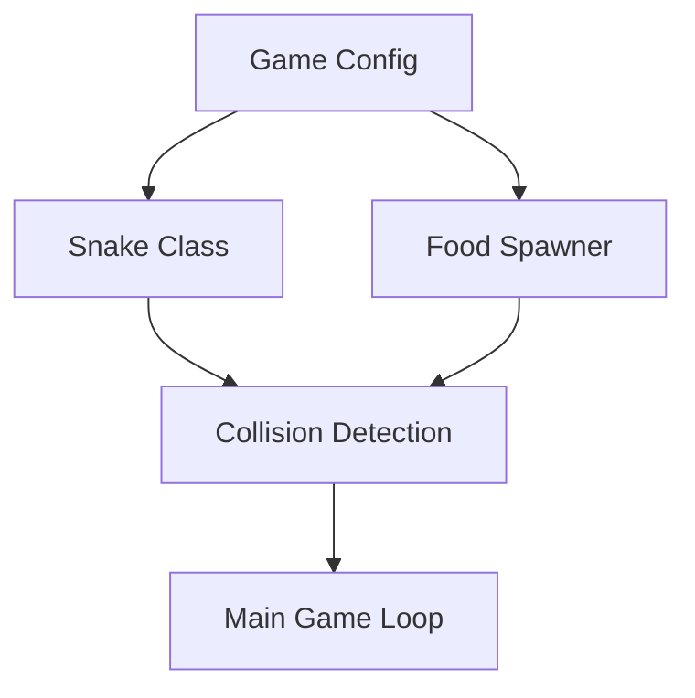

# Code Agent Platform

AI-powered code generation platform demonstrating enterprise agentic AI patterns.

## Quick Start
```bash
# Terminal 1: Python agent-service
cd agent-service
source ../.venv/bin/activate
USE_MOCK_LLM=true uvicorn app.main:app --reload

# Terminal 2: Java gateway
cd gateway-service
./mvnw spring-boot:run

# Open http://localhost:8080
```

## Current Architecture


## Request Flow


## CodeAgent Workflow (LangGraph)


| Node | Purpose | Tool |
|------|---------|------|
| identify | Classify task type | LLM |
| execute | Generate Python code | LLM |
| evaluate | Validate syntax | AST Parser |

## Planner Agent

The PlannerAgent decomposes complex tasks into execution plans before code generation.

**IMPORTANT: Current Limitations & Issues to Fix**

### Issue 1: No Real Orchestration
The planner currently provides **documentation/visualization only** - it does NOT orchestrate multi-step execution.
- **Current flow**: Planner (1 LLM call) → Code Agent generates ALL code in single LLM call
- **Misleading UI**: Shows "5 steps" and "4 parallel stages" but nothing actually runs in parallel
- **Future enhancement**: True multi-step orchestration where Planner delegates to sub-agents

### Issue 2: Confusing "Parallel Stages" Calculation
The UI shows "Steps: 5 | Parallel stages: 4" which is misleading:
- Step 1 (game_config) - must run first
- Steps 2-3 (snake_class, food_class) - CAN be parallel (both depend only on config)
- Step 4 (collision_logic) - depends on steps 2 AND 3, must wait
- Step 5 (game_loop) - depends on step 4, must wait
- **Reality**: Only steps 2-3 can parallelize. The "4 parallel stages" metric is wrong.

### Issue 3: Misleading Metrics Display
Current UI shows:
```
57273 Total Time (ms)
5 Plan Steps
13865 Identify (ms)
43404 Execute (ms)
5 Evaluate (ms)
```
This doesn't reflect agent delegation. Should show:
```
Planner Agent:
  - Problem understanding: X ms
  - Problem decomposition: Y ms
  - Delegation decisions: Z ms

Code Agent:
  - Task received from Planner
  - Code generation: X ms
  - Syntax validation: Y ms
```

### Issue 4: No Agent-to-Agent Communication Visibility
Events should show:
```
Planner agent delegating "snake_class" to Code Agent
Code Agent working on "snake_class"
Code Agent completed "snake_class"
Code Agent returning response to Planner
```

### Target Architecture (Not Yet Implemented)
```
Planner Agent (Orchestrator)
  ├── Understands problem
  ├── Decomposes into sub-tasks
  ├── Decides parallelization strategy
  ├── Delegates to sub-agents:
  │     ├── Code Agent (step 1) → returns code
  │     ├── Code Agent (step 2) ─┬─ parallel → returns code
  │     ├── Code Agent (step 3) ─┘             → returns code
  │     ├── Code Agent (step 4) → returns code
  │     └── Code Agent (step 5) → returns code
  └── Assembles final response from all sub-agent outputs
```

### Current Flow (Actual)
1. Analyze task complexity (word count + keywords like "game", "api", "with tests")
2. Simple tasks → single step, skip LLM
3. Complex tasks → LLM breaks into steps with dependencies
4. Compute parallel execution stages (topological sort)
5. Generate Mermaid diagram for visualization
6. **Pass entire plan as context to Code Agent (single code generation call)**

### SSE Events
| Event | Data | Description |
|-------|------|-------------|
| `plan_start` | `{task}` | Planning begins |
| `plan_analysis` | `{is_complex, word_count}` | Complexity analysis result |
| `plan_step_identified` | `{step_id, task, depends_on, complexity}` | Each step as identified |
| `plan_complete` | `{total_steps, parallel_stages, mermaid}` | Plan ready with diagram |

### Key Files
| File | Purpose |
|------|---------|
| `planner/models.py` | PlanStep, ProjectPlan, PlannerConfig |
| `planner/prompt.py` | LLM prompts, parse_llm_response |
| `planner/planner_agent.py` | Main PlannerAgent class |
| `llm/registry.py` | LLMRegistry for multi-agent LLM routing |

### Example Mermaid Output (Snake Game)


## Key Files

### Java Gateway
| File | Purpose |
|------|---------|
| `GatewayApplication.java` | Spring Boot entry |
| `TaskController.java` | Proxy to Python, SSE streaming |
| `AuthFilter.java` | JWT validation (TODO) |
| `RateLimitFilter.java` | Rate limiting (TODO) |

### Python Agent
| File | Purpose |
|------|---------|
| `routes.py` | POST /tasks, /tasks/execute |
| `code_agent.py` | LangGraph workflow |
| `task_execution.py` | Observable progress, SSE events |
| `grok_client.py` | xAI Grok LLM |
| `mock_client.py` | Mock LLM for testing |
| `logging_utils.py` | Request tracing [req-xxx] |

## Server Logs
```bash
# Python logs
tail -f /tmp/python-server.log

# Java logs
tail -f /tmp/java-server.log

# Filter by request ID
grep "req-abc123" /tmp/python-server.log
```

## Module Status

| Module | Status |
|--------|--------|
| 1-5 Foundation | ✅ |
| 6 SSE Streaming | ✅ |
| 7 Code Execution | ✅ |
| 8 Java Gateway | ✅ |
| 11 Planner Agent | ✅ |
| 9+ See README | 📋 |
