# Code Agent Platform - Technical Reference

AI-powered code generation platform demonstrating enterprise agentic AI patterns using **LangGraph**, **FastAPI**, and **Spring Boot**.

---

## Quick Start

```bash
# Terminal 1: Python agent-service
cd agent-service
source ../.venv/bin/activate
USE_MOCK_LLM=true uvicorn app.main:app --reload

# Terminal 2: Java gateway
cd gateway-service
./mvnw spring-boot:run

# Open http://localhost:8080
```

## Using Real LLM (OpenRouter)

```bash
export OPENROUTER_API_KEY=your-key-here
export OPENROUTER_MODEL=meta-llama/llama-3.3-70b-instruct
cd agent-service && uvicorn app.main:app --reload
```

---

## System Architecture Overview


---

## LangGraph StateGraph Implementation

### Core Concept

The **LangGraphManager** uses LangGraph's `StateGraph` to define a directed graph where:
- **Nodes** are async functions that process state and return updates
- **Edges** define transitions between nodes
- **Conditional Edges** enable dynamic routing based on state

### Graph Definition


### State Definition (TypedDict)

```python
class AgentState(TypedDict):
    # Input
    task: str                    # User's task description

    # Build phase
    code: str                    # Generated Python code
    tests: str                   # Generated pytest tests

    # Review phase
    review_passed: bool          # Did code pass review?
    issues: list[ReviewIssue]    # Blocking/non-blocking issues

    # Tracking
    attempt: int                 # Current attempt (1-3)
    max_attempts: int            # Max retries (default: 3)
    previous_code: str           # For reflection loop

    # Documentation phase
    documented_code: str         # Code with docstrings
    readme: str                  # Generated README

    # Output
    success: bool                # Workflow success
    error_message: str           # Error if failed
    start_time: float            # For duration tracking
```

### Graph Construction Code

```python
def _build_graph(self) -> StateGraph:
    graph = StateGraph(AgentState)

    # Add nodes (async functions)
    graph.add_node("builder", self._builder_node)
    graph.add_node("reviewer", self._reviewer_node)
    graph.add_node("docgen", self._docgen_node)

    # Set entry point
    graph.set_entry_point("builder")

    # Add edges
    graph.add_edge("builder", "reviewer")  # Always: builder → reviewer

    # Conditional edges from reviewer
    graph.add_conditional_edges(
        "reviewer",
        self._should_retry_or_continue,  # Routing function
        {
            "retry": "builder",    # Failed, retry
            "continue": "docgen",  # Passed, continue
            "fail": END,           # Max retries, end
        }
    )

    graph.add_edge("docgen", END)  # Always: docgen → END

    return graph
```

### Conditional Routing Function

```python
def _should_retry_or_continue(self, state: AgentState) -> Literal["retry", "continue", "fail"]:
    review_passed = state.get("review_passed", False)
    attempt = state.get("attempt", 1)
    max_attempts = state.get("max_attempts", 3)

    if review_passed:
        return "continue"  # → docgen

    if attempt < max_attempts:
        return "retry"     # → builder (reflection)

    return "fail"          # → END
```

---

## End-to-End Request Flow

### Complete Sequence Diagram


### Reflection Loop (When Review Fails)

```mermaid
sequenceDiagram
    autonumber
    participant Manager as LangGraphManager
    participant Builder as SoftwareBuilderAgent
    participant Reviewer as SoftwareReviewerAgent
    participant LLM

    Note over Manager: Attempt 1
    Manager->>Builder: Generate code
    Builder->>LLM: Plan + Generate
    Builder-->>Manager: CodeOutput

    Manager->>Reviewer: Review code
    Reviewer->>LLM: Senior engineer review
    Reviewer-->>Manager: {passed: false, issues: [blocking...]}

    Note over Manager: REFLECTION TRIGGERED
    Manager-->>Manager: _should_retry_or_continue() → "retry"
    Manager-->>Browser: SSE: reflection_start {attempt: 1, issues}

    Note over Manager: Attempt 2 (Reflection)
    Manager->>Builder: Fix code with feedback
    Note over Builder: Uses REFLECTION_TEMPLATE<br/>with previous_code + issues
    Builder->>LLM: Fix based on feedback
    Builder-->>Manager: Fixed CodeOutput

    Manager->>Reviewer: Re-review
    Reviewer->>LLM: Review fixed code
    Reviewer-->>Manager: {passed: true}

    Note over Manager: CONTINUE TO DOCGEN
    Manager->>Manager: _should_retry_or_continue() → "continue"
```



---

## LLM Calls Breakdown

### Successful First Attempt (4 LLM calls)

| Phase | Agent | LLM Calls | Purpose |
|-------|-------|-----------|---------|
| Build | Builder | 1 | Create implementation plan |
| Build | Builder | 1 | Generate code + tests |
| Review | Reviewer | 1 | Senior engineer code review |
| Docs | DocGen | 1 | Add docstrings + README |
| **Total** | | **4** | |

### With 1 Retry (6 LLM calls)

| Phase | Agent | LLM Calls | Purpose |
|-------|-------|-----------|---------|
| Build (1st) | Builder | 2 | Plan + generate |
| Review (1st) | Reviewer | 1 | Review (finds blocking issues) |
| Build (retry) | Builder | 1 | Fix based on feedback |
| Review (retry) | Reviewer | 1 | Review again |
| Docs | DocGen | 1 | Add docstrings + README |
| **Total** | | **6** | |

---

## Agent Responsibilities

### LangGraphManager (Orchestrator)

**Location:** `agents/manager/langgraph_manager.py`

- Creates StateGraph with nodes for builder, reviewer, docgen
- Manages state flow between nodes
- Handles conditional routing for reflection loop
- Emits SSE events for real-time UI updates
- Assembles final ProjectResult

**LLM Calls:** 0 (pure orchestration)

### SoftwareBuilderAgent (Code Generator)

**Location:** `agents/builder/software_builder_agent.py`

**Normal Mode (2 LLM calls):**
1. Planning: Creates implementation approach
2. Coding: Generates code + pytest tests

**Reflection Mode (1 LLM call):**
1. Reads previous code + reviewer feedback
2. Generates fixed code addressing blocking issues

**Key Prompts:**
- `PLANNER_SYSTEM_PROMPT`: Brief implementation planning
- `BUILDER_SYSTEM_PROMPT`: Code generation with structure
- `REFLECTION_SYSTEM_PROMPT`: Fix code based on feedback

### SoftwareReviewerAgent (Code Reviewer)

**Location:** `agents/reviewer/software_reviewer_agent.py`

**Two-Phase Validation:**
1. **Syntax Check** (no LLM): AST parsing for valid Python
2. **Code Review** (1 LLM call): FAANG-style senior engineer review

**Review Categories:**
- **BLOCKING**: Crashes, missing core functionality, security issues
- **NON-BLOCKING**: Style, edge cases, performance suggestions

**LLM Calls:** 1

### DocumentationGeneratorAgent

**Location:** `agents/docgen/documentation_generator_agent.py`

- Adds Google-style docstrings to all functions/classes
- Generates README.md with usage examples
- Single LLM call for both tasks

**LLM Calls:** 1

---

## SSE Events Reference

### Manager Events

| Event | Data | Description |
|-------|------|-------------|
| `manager_received_task` | `{task}` | Workflow starting |
| `manager_plan` | `{steps, team_summary}` | Workflow plan |
| `manager_delegating` | `{agent, agent_id, action}` | Delegating to agent |
| `reflection_start` | `{attempt, max_attempts, issues}` | Retry starting |
| `manager_complete` | `{success, total_attempts, duration_ms}` | Workflow done |

### Builder Events

| Event | Data | Description |
|-------|------|-------------|
| `builder_planning_start` | `{agent_id, task}` | Planning phase |
| `builder_planning_complete` | `{agent_id, plan}` | Plan ready |
| `builder_coding_start` | `{agent_id}` | Generating code |
| `builder_coding_complete` | `{agent_id, code_lines}` | Code ready |

### Reviewer Events

| Event | Data | Description |
|-------|------|-------------|
| `reviewer_planning_start` | `{agent_id, code_lines}` | Starting review |
| `reviewer_planning_complete` | `{agent_id, plan}` | Review plan |
| `reviewer_step_start` | `{step, description}` | Validation step |
| `reviewer_step_complete` | `{step, passed, message, blocking_issues, nonblocking_issues}` | Step result |
| `reviewer_complete` | `{passed, errors, warnings, blocking_issues}` | Review done |

### DocGen Events

| Event | Data | Description |
|-------|------|-------------|
| `docgen_start` | `{agent_id, code_lines}` | Starting docs |
| `docgen_complete` | `{agent_id, readme_lines}` | Docs ready |

### Final Result

| Event | Data | Description |
|-------|------|-------------|
| `result` | `{task_id, status, generated_code, error, total_duration_ms}` | Final output |

---

## Data Models

### Location: `agent-service/app/models/`

| File | Models |
|------|--------|
| `agents.py` | `AgentType`, `Agent` (Protocol), `AgentInfo`, `AgentTeam` |
| `planning.py` | `PlanStep`, `ExecutionStage`, `ExecutionPlan` |
| `execution.py` | `StepTask`, `CodeOutput`, `ReviewIssue`, `ReviewResult`, `CompletedStep`, `DocumentedCode`, `ProjectResult` |

### Key Data Flow

```
User Request
    ↓
StepTask (task, project_goal, issues?, previous_code?)
    ↓
CodeOutput (code, tests)
    ↓
ReviewResult (passed, issues[])
    ↓
CompletedStep (code, tests, attempts, passed)
    ↓
DocumentedCode (code with docstrings, readme)
    ↓
ProjectResult (final code, tests, readme, success)
```

---

## Directory Structure

```
agent-service/app/
├── agents/
│   ├── __init__.py              # Export all agents
│   ├── manager/
│   │   ├── __init__.py          # Exports LangGraphManager
│   │   ├── langgraph_manager.py # LangGraph StateGraph implementation ⭐
│   │   └── manager_agent.py     # Legacy custom implementation
│   ├── builder/
│   │   ├── __init__.py
│   │   └── software_builder_agent.py  # Code generation
│   ├── reviewer/
│   │   ├── __init__.py
│   │   └── software_reviewer_agent.py # Code review
│   └── docgen/
│       ├── __init__.py
│       └── documentation_generator_agent.py
├── models/
│   ├── __init__.py              # Export all models
│   ├── agents.py                # AgentType, AgentTeam
│   ├── planning.py              # ExecutionPlan, PlanStep
│   └── execution.py             # StepTask, CodeOutput, etc.
├── llm/
│   ├── __init__.py
│   ├── registry.py              # LLMRegistry
│   ├── mock_client.py           # MockLLMClient
│   └── openrouter_client.py     # OpenRouterClient
├── api/
│   ├── routes.py                # POST /tasks, /tasks/execute
│   └── workflow_events.py       # SSE event factories
├── tools/
│   └── code_executor.py         # Subprocess execution
├── core/
│   ├── base_llm.py              # BaseLLMClient interface
│   └── base_tool.py             # BaseTool interface
└── logging_utils.py             # Structured logging
```

---

## Server Logs

```bash
# Python logs with detailed agent activity
[req-task-65c] ══════════════════════════════════════════════════════════════════
[req-task-65c] 🆕 NEW REQUEST
[req-task-65c] ──────────────────────────────────────────────────────────────────
[req-task-65c] 📝 Task: "Write a Python function to calculate fibonacci numbers"
[req-task-65c] 🤖 Mode: REAL (OpenRouter: meta-llama/llama-3.3-70b-instruct:free)
[req-task-65c]
[req-task-65c] ┌─ 🤖 SoftwareBuilderAgent
[req-task-65c] │  Action: generate code
[req-task-65c] │  📤 LLM Request: LLM call #1
[req-task-65c] │     [system] You are a Python expert...
[req-task-65c] │     [prompt] Create a plan to implement...
[req-task-65c] │  📥 LLM Response (156 tokens, 2345ms)
[req-task-65c] │  Result: Generated 45 lines
[req-task-65c] └─ ✅ Done (8234ms)
[req-task-65c]
[req-task-65c] ┌─ 🤖 SoftwareReviewerAgent
[req-task-65c] │  Action: review 45 lines of code
[req-task-65c] │  ✅ Syntax Check: Valid Python
[req-task-65c] │  ✅ Code Review: 0 blocking, 2 non-blocking
[req-task-65c] │  Result: PASSED
[req-task-65c] └─ ✅ Done (1456ms)
[req-task-65c]
[req-task-65c] ══════════════════════════════════════════════════════════════════
[req-task-65c] ✅ COMPLETE | 15234ms total | 1851 chars generated
[req-task-65c] ══════════════════════════════════════════════════════════════════
```

---

## Future Extensions

### Near-term Additions

| Extension | Description | Complexity |
|-----------|-------------|------------|
| **Docker Sandboxing** | Execute code in isolated containers | Medium |
| **Redis State Store** | Persist LangGraph state for long-running tasks | Medium |
| **WebSocket Support** | Bi-directional communication for interactive sessions | Medium |
| **Multiple Languages** | Support for JavaScript, Go, Rust code generation | High |

### Enterprise Features

| Extension | Description | Pattern |
|-----------|-------------|---------|
| **Authentication** | JWT tokens + OAuth 2.0 integration | Security |
| **Rate Limiting** | Bucket4j for API throttling | Resilience |
| **Circuit Breaker** | Resilience4j for LLM failures | Resilience |
| **Distributed Tracing** | OpenTelemetry integration | Observability |
| **Kubernetes Deployment** | Helm charts + HPA | Infrastructure |

### Agentic AI Extensions

| Extension | Description | Pattern |
|-----------|-------------|---------|
| **Tool Use** | Give agents access to file system, git, APIs | Tool Use |
| **RAG Integration** | Vector DB for documentation lookup | Memory |
| **Human-in-the-Loop** | Approval gates for sensitive operations | Guardrails |
| **A2A Protocol** | Agent-to-agent communication | Multi-Agent |
| **MCP Integration** | Model Context Protocol for tool discovery | Interoperability |

---

## Module Status

| Module | Status | Description |
|--------|--------|-------------|
| 1-5 Foundation | ✅ | Core, Tools, Graph, API, Logging |
| 6 SSE Streaming | ✅ | Real-time progress events |
| 7 Code Execution | ✅ | Run generated code in UI |
| 8 Java Gateway | ✅ | Serve UI, proxy to Python |
| 11 Planner Agent | ✅ | Task decomposition (superseded) |
| 12 Multi-Agent + LangGraph | ✅ | StateGraph orchestration |
| 9 Auth & Rate Limiting | 📋 | JWT, Bucket4j |
| 10 Circuit Breaker | 📋 | Resilience4j |
| 13 Memory Store | 📋 | Context persistence |
| 14 Task Queue | 📋 | Async processing |
| 15 RAG Agent | 📋 | Documentation lookup |
| 16 Guardrails | 📋 | Safety validation |
| 17 Docker/K8s | 📋 | Containerization |
