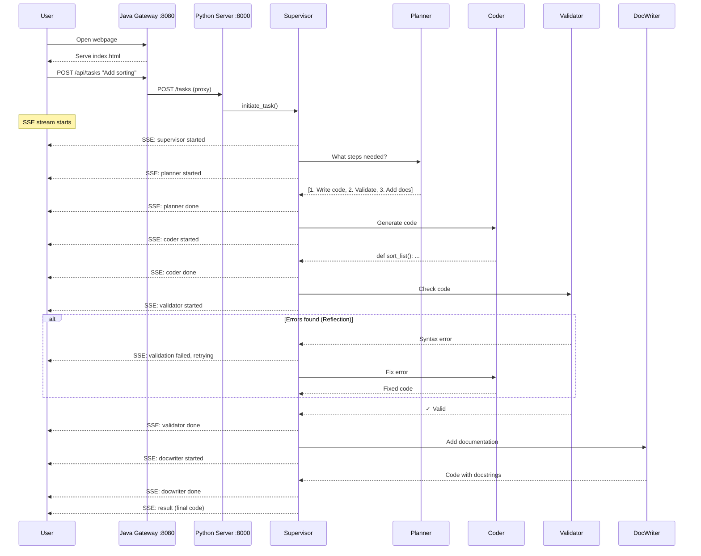

# Code Agent Platform

AI-powered code generation platform demonstrating enterprise agentic AI patterns.

## Quick Start
```bash
git clone https://github.com/aregmii/langgraph-agentic-dev-starter.git
cd langgraph-agentic-dev-starter

python3.11 -m venv .venv
source .venv/bin/activate
pip install -e "./agent-service[dev]"
echo 'XAI_API_KEY=your-key' > .env

cd agent-service
USE_MOCK_LLM=true uvicorn app.main:app --reload

# Open http://localhost:8000
```

## Architecture


## Agentic Design Patterns

| Pattern | Implementation | Status |
|---------|----------------|--------|
| **Prompt Chaining** | Identify → Execute → Evaluate | ✅ Done |
| **Structured Output** | TaskState dataclass | ✅ Done |
| **Routing** | LLM-based task classification | ✅ Done |
| **Reflection** | Validator → Coder error loop | ✅ Done |
| **Streaming** | SSE real-time events | ✅ Done |
| **Planning** | Planner Agent decomposes tasks | 📋 Planned |
| **Multi-Agent** | Supervisor orchestrates specialists | 📋 Planned |
| **Tool Use** | LLM selects tools dynamically | 📋 Planned |
| **Memory** | Short-term + long-term store | 📋 Planned |
| **Guardrails** | Input/output validation | 📋 Planned |
| **RAG** | Doc Agent with embeddings | 📋 Planned |

## Module Roadmap

| # | Module | Status | Description |
|---|--------|--------|-------------|
| 1-5 | Foundation | ✅ | Core interfaces, tools, graph, API, logging |
| 6 | SSE Streaming | ✅ | Real-time progress events |
| 7 | Code Execution | 🔜 | Run generated code in UI |
| 8 | Java Gateway | 📋 | Serve UI, proxy to Python |
| 9 | Auth & Rate Limiting | 📋 | JWT, Bucket4j |
| 10 | Circuit Breaker | 📋 | Resilience4j |
| 11 | Planner Agent | 📋 | Task decomposition |
| 12 | Multi-Agent Supervisor | 📋 | Orchestrate specialists |
| 13 | Memory Store | 📋 | Context persistence |
| 14 | Tool Registry | 📋 | Dynamic tool selection |
| 15 | RAG / Doc Agent | 📋 | Documentation lookup |
| 16 | Guardrails | 📋 | Safety validation |
| 17 | Prometheus Metrics | 📋 | Observability |
| 18 | Docker / K8s | 📋 | Containerization |

## Project Structure
```
langgraph-agentic-dev-starter/
├── agent-service/           # Python/FastAPI
│   └── app/
│       ├── agents/          # CodeAgent, TaskExecution
│       ├── api/             # Routes, SSE events
│       ├── llm/             # Grok + Mock clients
│       └── tools/           # Syntax checker, code runner
├── gateway-service/         # Java/Spring Boot (planned)
└── web-ui/                  # Browser interface
```

## Mock vs Real Mode

| Mode | Command | Speed | Cost |
|------|---------|-------|------|
| Mock | `USE_MOCK_LLM=true uvicorn ...` | ~300ms | Free |
| Real | `uvicorn ...` | ~12,000ms | API credits |
