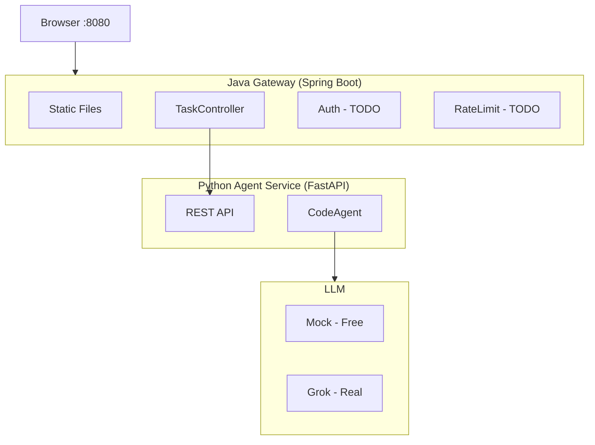
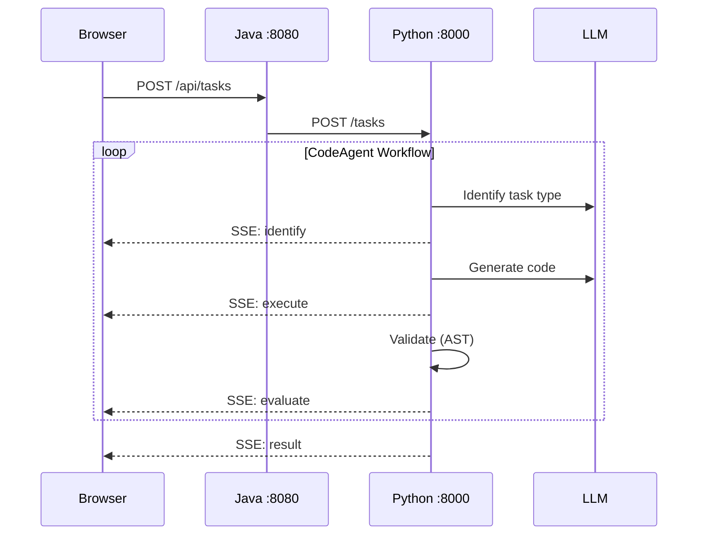
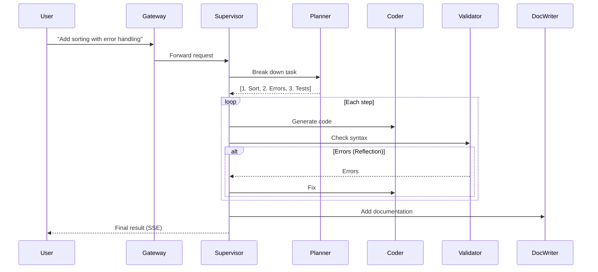

# Code Agent Platform

AI-powered code generation platform demonstrating enterprise agentic AI patterns.

## Quick Start
```bash
git clone https://github.com/aregmii/langgraph-agentic-dev-starter.git
cd langgraph-agentic-dev-starter

# Setup Python
python3.11 -m venv .venv
source .venv/bin/activate
pip install -e "./agent-service[dev]"
echo 'XAI_API_KEY=your-key' > .env

# Terminal 1: Start Python
cd agent-service
USE_MOCK_LLM=true uvicorn app.main:app --reload

# Terminal 2: Start Java
cd gateway-service
./mvnw spring-boot:run

# Open http://localhost:8080
```

## Architecture


## Request Flow


## Target Architecture (Multi-Agent)


## Agentic Design Patterns

| Pattern | Implementation | Status |
|---------|----------------|--------|
| **Prompt Chaining** | Identify → Execute → Evaluate | ✅ |
| **Structured Output** | TaskState dataclass | ✅ |
| **Routing** | LLM-based task classification | ✅ |
| **Reflection** | Validator → Coder retry loop | ✅ |
| **Streaming** | SSE real-time events | ✅ |
| **Planning** | Planner Agent | 📋 |
| **Multi-Agent** | Supervisor orchestration | 📋 |
| **Tool Use** | Dynamic tool selection | 📋 |
| **Memory** | Context persistence | 📋 |
| **Guardrails** | Input/output validation | 📋 |

## Module Roadmap

| # | Module | Status | Description |
|---|--------|--------|-------------|
| 1-5 | Foundation | ✅ | Core, Tools, Graph, API, Logging |
| 6 | SSE Streaming | ✅ | Real-time progress events |
| 7 | Code Execution | ✅ | Run generated code in UI |
| 8 | Java Gateway | ✅ | Serve UI, proxy to Python |
| 9 | Auth & Rate Limiting | 📋 | JWT, Bucket4j |
| 10 | Circuit Breaker | 📋 | Resilience4j |
| 11 | Planner Agent | 📋 | Task decomposition |
| 12 | Multi-Agent Supervisor | 📋 | Orchestrate specialists |
| 13 | Memory Store | 📋 | Context persistence |
| 14 | Task Queue | 📋 | Decouple submission from processing |
| 15 | RAG / Doc Agent | 📋 | Documentation lookup |
| 16 | Guardrails | 📋 | Safety validation |
| 17 | Docker / K8s | 📋 | Containerization |

## Future: Task Queue Architecture

To independently scale task submission and worker processing, we plan to explore Redis-based queue patterns:

- **Lists** (LPUSH/BRPOP) - Simple FIFO queue
- **Sorted Sets** (ZADD/ZREM) - Priority-based processing
- **Streams** (XADD/XREAD) - Consumer groups, acknowledgments

This will enable:
- Decoupled scaling (more workers without changing gateway)
- Fault tolerance (tasks persist if workers restart)
- Backpressure handling (queue depth monitoring)

## Project Structure
```
langgraph-agentic-dev-starter/
├── agent-service/           # Python/FastAPI
│   └── app/
│       ├── agents/          # CodeAgent, TaskExecution
│       ├── api/             # Routes, SSE events
│       ├── llm/             # Grok + Mock clients
│       └── tools/           # Syntax checker, code runner
├── gateway-service/         # Java/Spring Boot
│   └── src/main/java/
│       ├── controller/      # TaskController
│       └── filter/          # Auth, RateLimit (TODO)
└── web-ui/                  # Legacy (now in gateway)
```
