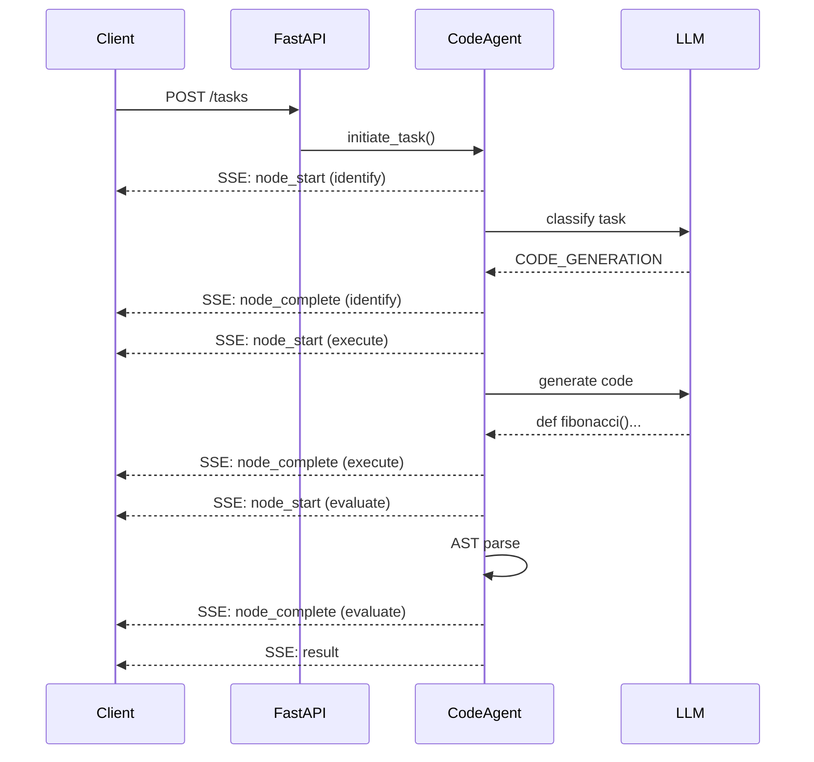

# LangGraph Agentic Code Assistant

AI-powered code generation agent with real-time SSE streaming.

## 🎯 Features

- **Real-time progress** via Server-Sent Events (SSE)
- **Code generation** using Grok LLM
- **Syntax validation** via AST parsing
- **Mock mode** for free development/testing
- **Request tracing** with unique IDs for concurrent requests

## 🏗️ Architecture



## 🚀 Quick Start

```bash
# Setup
git clone https://github.com/aregmii/langgraph-agentic-dev-starter.git
cd langgraph-agentic-dev-starter
python3.11 -m venv .venv
source .venv/bin/activate
pip install -e "./agent-service[dev]"
echo 'XAI_API_KEY=your-key' > .env

# Run (mock mode - free)
cd agent-service
USE_MOCK_LLM=true uvicorn app.main:app --reload

# Open browser
open http://localhost:8000/static/test-sse.html
```

## 🧪 Mock vs Real Mode

| Mode | Command | Speed | Cost |
|------|---------|-------|------|
| Mock | `USE_MOCK_LLM=true uvicorn ...` | ~300ms | Free |
| Real | `uvicorn ...` | ~12,000ms | API credits |

## 📊 Module Progress

| Module | Status | Description |
|--------|--------|-------------|
| 0-5 | ✅ | Foundation, Core, Tools, Graph, API, Logging |
| 6: SSE Streaming | ✅ | Real-time progress events |
| 7: Code Execution | 🔜 | Run generated code in UI |
| 8+: Error Handling, RAG, Multi-Agent | 📋 | Planned |

## 📝 Server Logs

Every log line has request ID for concurrent request tracing:

```
[req-e2056620] ══════════════════════════════════════════════════════════════════
[req-e2056620] 🆕 NEW REQUEST
[req-e2056620] 📝 Task: "Write a fibonacci function"
[req-e2056620] 🤖 Mode: REAL (using Grok API)
[req-e2056620]
[req-e2056620] → [CodeAgent] Classifying task type using LLM...
[req-e2056620] ✓ Done (978ms) → Task type: code_generation
[req-e2056620]
[req-e2056620] → [CodeAgent] Generating code using LLM...
[req-e2056620] ✓ Done (11364ms) → Generated 3308 chars
[req-e2056620]
[req-e2056620] → [CodeAgent] Validating syntax using AST parser...
[req-e2056620] ✓ Done (2ms) → Passed! Score: 1.0
[req-e2056620]
[req-e2056620] ══════════════════════════════════════════════════════════════════
[req-e2056620] ✅ COMPLETE | 12344ms total | 3308 chars generated
[req-e2056620] ══════════════════════════════════════════════════════════════════
```

## 📄 License

MIT
