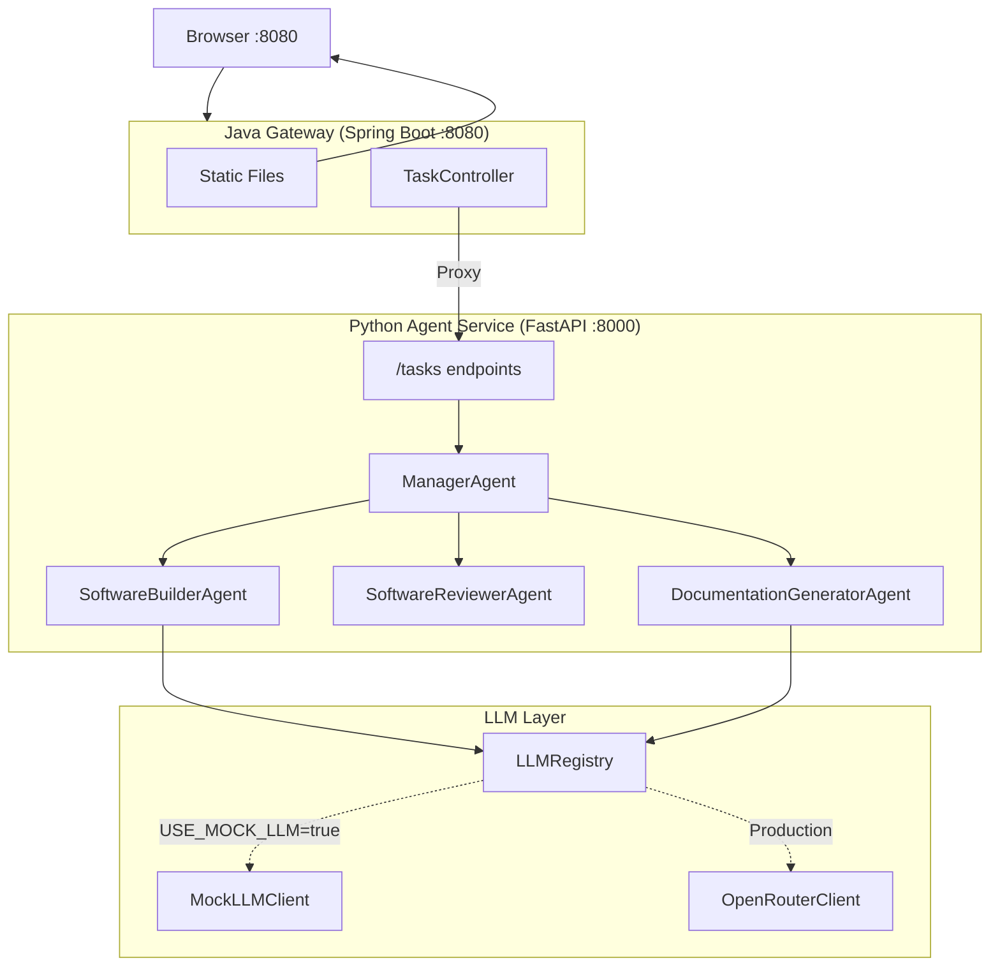
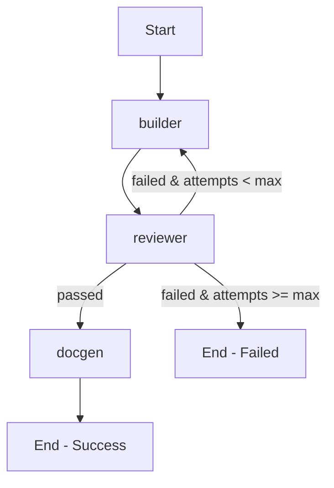
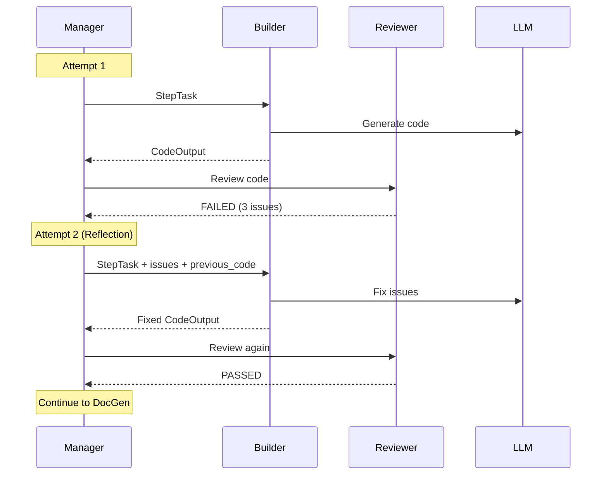

# Code Agent Platform

AI-powered code generation platform demonstrating **enterprise agentic AI patterns** using LangGraph, FastAPI, and Spring Boot.

## Quick Start

```bash
git clone https://github.com/aregmii/langgraph-agentic-dev-starter.git
cd langgraph-agentic-dev-starter

# Setup Python
python3.11 -m venv .venv
source .venv/bin/activate
pip install -e "./agent-service[dev]"

# Terminal 1: Start Python (mock mode)
cd agent-service
USE_MOCK_LLM=true uvicorn app.main:app --reload

# Terminal 2: Start Java Gateway
cd gateway-service
./mvnw spring-boot:run

# Open http://localhost:8080
```

## Using Real LLM (OpenRouter)

```bash
export OPENROUTER_API_KEY=your-key-here
export OPENROUTER_MODEL=anthropic/claude-3.5-sonnet  # or meta-llama/llama-3.3-70b-instruct

cd agent-service
uvicorn app.main:app --reload
```

---

## System Architecture



---

## LangGraph Implementation

This project uses **LangGraph's StateGraph** for workflow orchestration with typed state management.

### StateGraph Definition

```python
from langgraph.graph import StateGraph, END

class AgentState(TypedDict):
    task: str
    code: str
    tests: str
    review_passed: bool
    issues: list[ReviewIssue]
    attempt: int
    max_attempts: int
    # ... more fields

# Build the graph
graph = StateGraph(AgentState)
graph.add_node("builder", builder_node)
graph.add_node("reviewer", reviewer_node)
graph.add_node("docgen", docgen_node)

graph.set_entry_point("builder")
graph.add_edge("builder", "reviewer")
graph.add_conditional_edges("reviewer", should_retry_or_continue, {
    "retry": "builder",      # Failed → retry
    "continue": "docgen",    # Passed → continue
    "fail": END,             # Max retries → end
})
graph.add_edge("docgen", END)
```

### Workflow Visualization



---

## Multi-Agent Architecture

The Manager orchestrates a team of specialized agents using the **delegation pattern**.

```
┌─────────────────────────────────────────────────────────────────────────────┐
│                             MANAGER AGENT                                   │
│                                                                             │
│   Team: AgentTeam                                                           │
│   ┌─────────────────────────────────────────────────────────────────────┐  │
│   │   builders: [SoftwareBuilderAgent-1]     # Extensible              │  │
│   │   reviewers: [SoftwareReviewerAgent-1]   # Extensible              │  │
│   │   docgens: [DocumentationGeneratorAgent-1]                         │  │
│   └─────────────────────────────────────────────────────────────────────┘  │
└─────────────────────────────────────────────────────────────────────────────┘
```

### Agent Types

| Agent | Purpose | LLM Calls |
|-------|---------|-----------|
| **ManagerAgent** | Fixed workflow orchestration (Builder → Reviewer → DocGen) | 0 |
| **SoftwareBuilderAgent** | Creates plan, generates code + tests | 2 |
| **SoftwareReviewerAgent** | Validates syntax, runs tests, quality checks | 0 |
| **DocumentationGeneratorAgent** | Adds docstrings, generates README | 1 |

### End-to-End Sequence Diagram

```mermaid
sequenceDiagram
    participant Browser
    participant Java as Java Gateway :8080
    participant Python as Python :8000
    participant Manager as ManagerAgent
    participant Builder as SoftwareBuilderAgent
    participant Reviewer as SoftwareReviewerAgent
    participant DocGen as DocGenAgent
    participant LLM

    Browser->>Java: POST /api/tasks {description}
    Java->>Python: POST /tasks {description}

    Note over Browser: SSE Stream Opens

    Python->>Manager: run(task)
    Manager-->>Browser: SSE: manager_planning_start
    Manager-->>Browser: SSE: manager_planning_complete

    rect rgb(40, 60, 80)
        Note over Builder: Code Generation
        Builder-->>Browser: SSE: builder_planning_start
        Builder->>LLM: Create implementation plan
        Builder-->>Browser: SSE: builder_planning_complete
        Builder-->>Browser: SSE: builder_coding_start
        Builder->>LLM: Generate code + tests
        Builder-->>Browser: SSE: builder_coding_complete
        Builder-->>Manager: CodeOutput
    end

    rect rgb(60, 40, 80)
        Note over Reviewer: Validation
        Reviewer-->>Browser: SSE: reviewer_planning_start
        Reviewer-->>Browser: SSE: reviewer_planning_complete
        Reviewer-->>Browser: SSE: reviewer_step_start (syntax)
        Reviewer-->>Browser: SSE: reviewer_step_complete
        Reviewer-->>Browser: SSE: reviewer_step_start (tests)
        Reviewer-->>Browser: SSE: reviewer_step_complete
        Reviewer-->>Manager: ReviewResult
    end

    alt Review Failed & Attempts < Max
        Manager-->>Browser: SSE: reflection_start
        Note over Manager,Reviewer: Retry Loop
    end

    rect rgb(40, 80, 60)
        Note over DocGen: Documentation
        Manager->>DocGen: CompletedSteps
        DocGen->>LLM: Add docstrings + README
        DocGen-->>Manager: DocumentedCode
        Manager-->>Browser: SSE: docgen_complete
    end

    Manager-->>Browser: SSE: manager_complete
    Manager-->>Browser: SSE: result {code, tests, readme}
```



### Reflection Loop (Self-Correction)



---

## Agentic Design Patterns

| Pattern | Implementation | Status |
|---------|----------------|--------|
| **Prompt Chaining** | Manager → Builder → Reviewer → DocGen pipeline | ✅ |
| **Structured Output** | Pydantic models, TypedDict state, dataclasses | ✅ |
| **Routing** | Conditional edges based on review results | ✅ |
| **Reflection** | Builder ↔ Reviewer retry loop with issue feedback | ✅ |
| **Streaming** | SSE real-time events to browser | ✅ |
| **Planning** | Builder creates implementation plan before coding | ✅ |
| **Multi-Agent** | Manager + Team orchestration with delegation | ✅ |
| **Orchestrator-Worker** | Manager orchestrates, agents execute | ✅ |
| **Tool Use** | Code executor, syntax validator | ✅ |
| **Parallelization** | Stage-based parallel execution (prepared) | 📋 |
| **Memory** | Context persistence across sessions | 📋 |
| **Guardrails** | Input/output validation, safety checks | 📋 |

---

## Data Models

```python
# agents.py - Agent definitions
AgentType = Literal["builder", "reviewer", "docgen"]
AgentTeam(builders=[...], reviewers=[...], docgens=[...])

# planning.py - Execution planning
PlanStep(step_id, description, dependencies)
ExecutionStage(stage_id, steps, parallel=False)
ExecutionPlan(stages=[...], metadata)

# execution.py - Runtime data flow
StepTask → CodeOutput → ReviewResult → CompletedStep → ProjectResult
```

---

## SSE Events Reference

| Event | Payload | Description |
|-------|---------|-------------|
| `manager_planning_start` | `{task}` | Workflow starting |
| `manager_planning_complete` | `{workflow, steps}` | Workflow ready |
| `builder_planning_start` | `{agent_id, task}` | Builder planning |
| `builder_planning_complete` | `{agent_id, plan}` | Plan ready |
| `builder_coding_start` | `{agent_id}` | Code generation started |
| `builder_coding_complete` | `{agent_id, code_lines}` | Code generated |
| `reviewer_planning_start` | `{agent_id, code_lines}` | Validation planning |
| `reviewer_step_start` | `{step, description}` | Validation step started |
| `reviewer_step_complete` | `{step, passed, message}` | Validation step done |
| `reviewer_complete` | `{agent_id, passed, errors}` | All validation done |
| `reflection_start` | `{attempt, max_attempts, issues}` | Retry starting |
| `docgen_complete` | `{agent_id, readme_lines}` | Documentation added |
| `manager_complete` | `{success, total_attempts, duration_ms}` | Workflow complete |
| `result` | `{task_id, status, generated_code}` | Final result |

---

## Project Structure

```
langgraph-agentic-dev-starter/
├── agent-service/                    # Python/FastAPI
│   └── app/
│       ├── agents/
│       │   ├── manager/
│       │   │   └── langgraph_manager.py   # LangGraph StateGraph orchestration
│       │   ├── builder/
│       │   │   └── software_builder_agent.py
│       │   ├── reviewer/
│       │   │   └── software_reviewer_agent.py
│       │   └── docgen/
│       │       └── documentation_generator_agent.py
│       ├── models/
│       │   ├── agents.py             # AgentType, AgentTeam
│       │   ├── planning.py           # ExecutionPlan, PlanStep
│       │   └── execution.py          # StepTask, CodeOutput, ReviewResult
│       ├── api/
│       │   ├── routes.py             # REST endpoints
│       │   └── workflow_events.py    # SSE event factories
│       ├── llm/
│       │   ├── registry.py           # LLMRegistry (role-based)
│       │   ├── mock_client.py        # Mock for testing
│       │   └── openrouter_client.py  # Production LLM
│       └── tools/
│           └── code_executor.py      # Safe code execution
├── gateway-service/                  # Java/Spring Boot
│   └── src/main/java/
│       └── controller/
│           └── TaskController.java   # Proxy + SSE streaming
└── CLAUDE.md                         # Detailed developer docs
```

---

## Module Roadmap

| # | Module | Status | Description |
|---|--------|--------|-------------|
| 1-5 | Foundation | ✅ | Core, Tools, Graph, API, Logging |
| 6 | SSE Streaming | ✅ | Real-time progress events |
| 7 | Code Execution | ✅ | Run generated code in UI |
| 8 | Java Gateway | ✅ | Serve UI, proxy to Python |
| 9 | Auth & Rate Limiting | 📋 | JWT, Bucket4j |
| 10 | Circuit Breaker | 📋 | Resilience4j |
| 11 | Planner Agent | ✅ | Task decomposition (legacy) |
| 12 | Multi-Agent | ✅ | Manager + team orchestration |
| 13 | Memory Store | 📋 | Redis context persistence |
| 14 | Task Queue | 📋 | RabbitMQ/Celery |
| 15 | RAG Agent | 📋 | Documentation lookup |
| 16 | Guardrails | 📋 | Safety validation |
| 17 | Docker/K8s | 📋 | Containerization |

---

## Future Extensions

### Near-Term (Enterprise Patterns)

| Extension | Description | Technologies |
|-----------|-------------|--------------|
| **Authentication** | JWT-based auth, API keys | Spring Security, OAuth2.0 |
| **Rate Limiting** | Token bucket per user/API key | Bucket4j, Redis |
| **Circuit Breaker** | Fault tolerance for LLM calls | Resilience4j |
| **Distributed Tracing** | Request tracing across services | OpenTelemetry, Jaeger |
| **Metrics** | Prometheus metrics, Grafana dashboards | Micrometer |

### Mid-Term (Agent Capabilities)

| Extension | Description | Technologies |
|-----------|-------------|--------------|
| **Memory Store** | Persist context across sessions | Redis, PostgreSQL |
| **Task Queue** | Async processing, retries | RabbitMQ, Celery |
| **Tool Use** | Dynamic tool selection by agents | LangChain Tools |
| **RAG Agent** | Documentation/code search | Vector DB, Embeddings |
| **Parallel Execution** | Run multiple builders concurrently | asyncio.gather |

### Long-Term (Scale & Safety)

| Extension | Description | Technologies |
|-----------|-------------|--------------|
| **Guardrails** | Input/output validation, PII detection | Guardrails AI |
| **Containerization** | Docker images, K8s deployment | Docker, Kubernetes |
| **Multi-Tenancy** | Isolated workspaces per user | Namespace isolation |
| **Model Routing** | Cost/quality optimization | Router patterns |

---

## Interview Topics Alignment

This project demonstrates expertise across multiple enterprise AI/ML engineering domains:

### Backend Engineering
- **Java/Spring Boot**: Gateway service with REST controllers, SSE streaming
- **Python/FastAPI**: Async API service with Pydantic models
- **REST API Design**: Client-agnostic endpoints, proper HTTP semantics

### Distributed Systems
- **Service-Oriented Architecture**: Decoupled gateway and agent services
- **Event-Driven Architecture**: SSE streaming for real-time updates
- **Domain-Driven Design**: Bounded contexts (agents, planning, execution)

### AI/ML Engineering
- **LangGraph**: StateGraph workflow orchestration
- **Multi-Agent Systems**: Manager-worker patterns, delegation
- **Agentic Patterns**: Reflection, routing, planning, tool use
- **LLM Integration**: OpenRouter, mock clients, registry pattern

### Observability
- **Structured Logging**: Request-scoped logs with correlation IDs
- **Event Tracing**: SSE events trace workflow execution
- **Metrics Ready**: Duration tracking, token counting

---

## License

MIT
